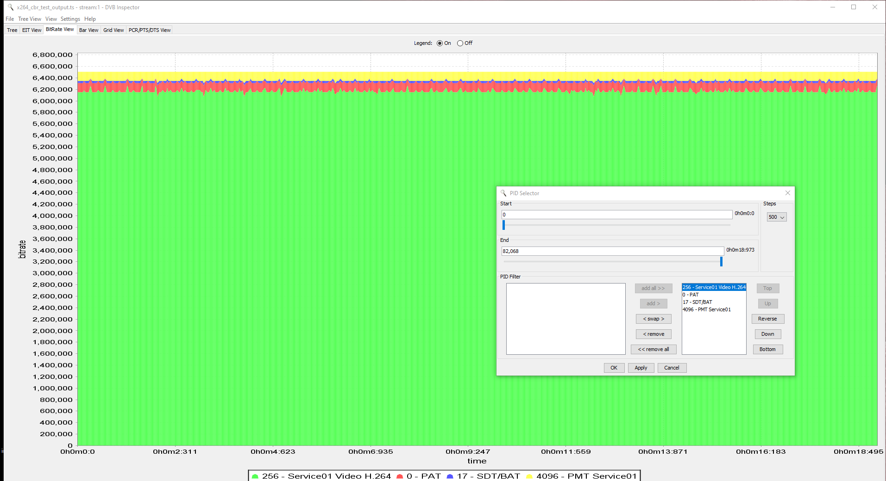
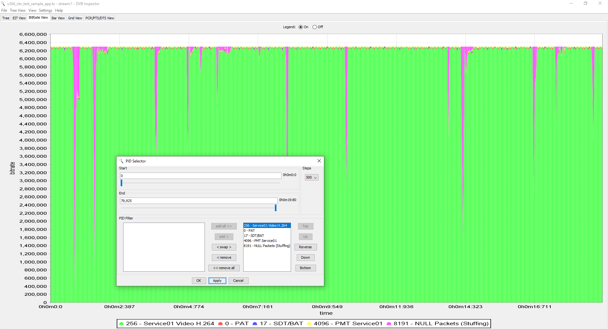

# FFmpeg libx264 CBR TS Test

This repository is used as a sample/test application to test the results of generating a CBR video elementary stream using [FFmpeg](http://ffmpeg.org/) in conjunction with the [x264](https://www.videolan.org/developers/x264.html) video codec. The concentration here within is solely on the video bitrate.

#### Background

What the author has noticed is that there are stark differences in the video bitrate with a CBR transport stream generated using FFmpeg cli vs a transport stream that is generated using the C-API. The transport stream generated from FFmpeg CLI appears relatively consistent. Why is that?

As an example, the following command line generates a fairly steady video bitrate:

```bash
ffmpeg -i cbr_test_file_input.mp4 -c:v libx264 -pix_fmt yuv420p -b:v 6000000 -preset fast -tune film -g 25 -x264-params vbv-maxrate=6000:vbv-bufsize=6000:force-cfr=1:nal-hrd=cbr -flags +ildct+ilme x264_cbr_test_output.ts
```

A graphed view of the bitrate:



If one tries to copy those settings (as attempted within this sample application), the graph looks like:




The above graphs have been generated using [DVB Inspector](https://sourceforge.net/projects/dvbinspector/). 

#### Test Media

A sample test file, [cbr_test_file_input.mp4](cbr_test_file_input.mp4), is provided for testing purposes.

This file has been reencoded, but the original file comes courtesy of [Xiph.org](https://media.xiph.org/video/derf/). Please take note of the file's accompanying [README](https://media.xiph.org/video/derf/vqeg.its.bldrdoc.gov/HDTV/NTIA_source/HDTV_Readme.txt) which lists credits and restrictions.

The original clip contains the following characteristics:
* 1080p60p30M (29.97fps)
* 4:2:2 chroma subsampling
* Progressive
* Lossless (y4m)

The file has been converted for the purposes of this test:
* Wanted to test with interlacing
* Need 25fps
* Need SD.

Using FFmpeg suite of tools, the file was converted:

```c
ffmpeg -i controlled_burn_1080p.y4m -filter_complex "[0:v]framerate=fps=50[framerate];[framerate]interlace=scan=tff[interlace];[interlace]scale=interl=1:flags=lanczos:width=720:height=576[scale]" -c:v libx264 -pix_fmt yuv420p -crf 10 -b:v 6000000 -preset slow -tune film -r 25 -map "[scale]" -flags +ildct+ilme cbr_test_file_input.mp4
```

So the test file's properties now consist of:
* 576i50 (25fps or 50 interlaced fields per/sec)
* 4:2:0 chroma subsampling.
* MP4 with H.264 elementary stream (no longer lossless)

#### Test Application

Enclosed in the repository is a sample application which takes in the aforementioned test media clip, and rencodes the file into what should be a H.264 CBR transport stream.

**WARNING**: This application has been written specifically for the purposes of this test media, so the author **acknowledges** that the sample application may require changes to work with different media and different media properties not limited to different resolutions, scan properties, etc.

This application has been built with
* GCC 9.3
* CMake
* C++ 17
* Linux Ubuntu 20.04 LTS
* FFmpeg v4.2.2
* x264 v1.55

Once built, the application can be run via:

```bash
./x264_cbr [file_in] [file_out]
```

...where [file_in] is the path to the input file, and [file_out] is the path to the encoded output file.

